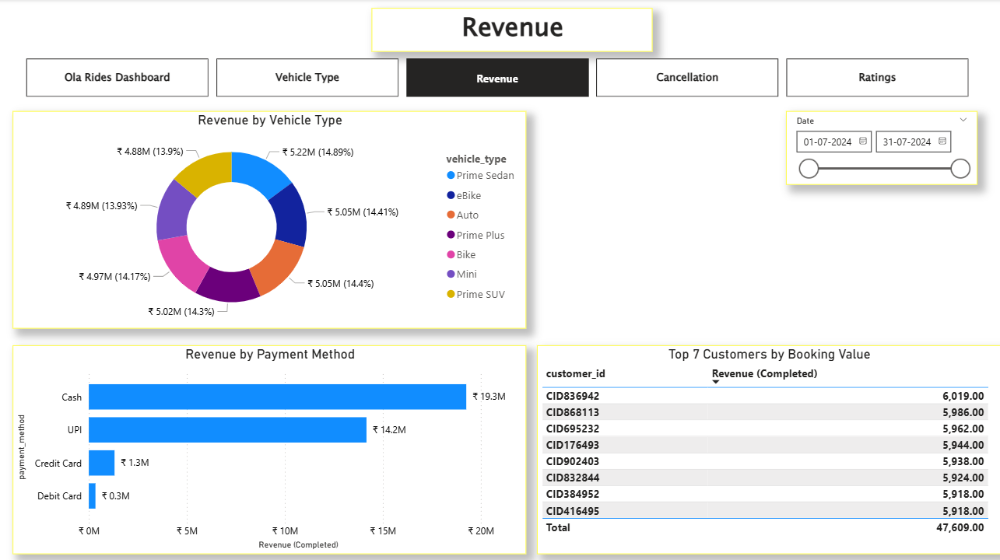
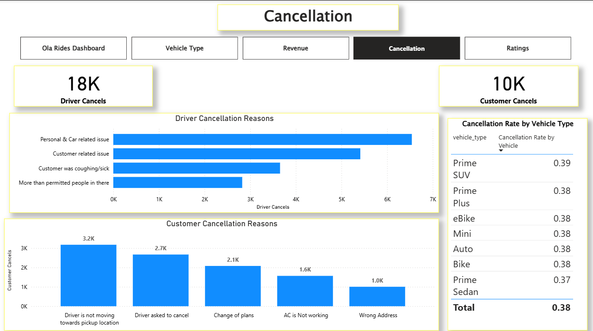
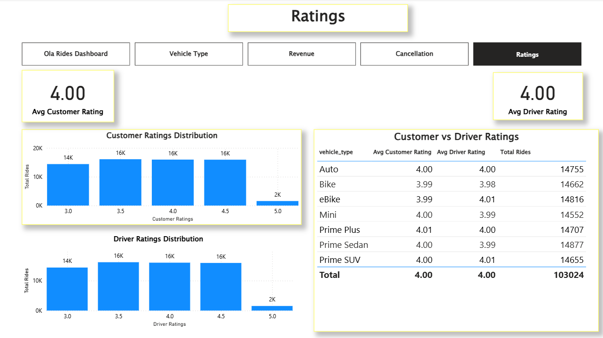

# Ola Rides Analytics

# Project Background: 
The rapid growth of ride-sharing platforms has reshaped urban transportation by offering affordable, on-demand mobility solutions. OLA, as one of India’s leading ride-hailing services, generates massive volumes of operational data encompassing ride bookings, cancellations, pricing, vehicle performance, driver behaviour, and customer feedback.
This project leverages data analytics and visualization techniques to transform raw ride data into actionable business insights using Python, SQL, Power BI, and Streamlit.

# Executive Summary:
This project analyzes 103K+ OLA rides using Python, SQL, Power BI, and Streamlit to identify trends in ride demand, revenue, cancellations, and customer satisfaction. The analysis generated ₹35.08M in revenue insights, highlighted key cancellation drivers, and showed consistently high service ratings (avg 4.0).

# Business Problem:
Despite having access to large volumes of ride data, OLA faces challenges in converting raw data into actionable insights. Key business gaps include understanding peak demand patterns, identifying top revenue drivers across vehicle types and payment methods, analyzing the root causes of ride cancellations, and evaluating service quality through customer and driver ratings. Addressing these gaps is critical to improving operational efficiency, enhancing customer experience, and maximizing profitability.

# Methodology
•	Data Understanding & EDA
	
   Reviewed dataset structure and key fields (booking status, vehicle type, payments, ratings, distance, revenue)
	
   Performed EDA to identify demand trends, anomalies, and patterns
   
•	Data Cleaning & Preprocessing (Python)
   
   Handled missing and inconsistent values
	
   Standardized date, time, and categorical formats
	
   Engineered derived features for improved analysis
   
•	SQL Analysis
	
   Developed optimized queries to analyze bookings, cancellations, revenue, ride distance, ratings, and customer behaviour
	
   Validated results against cleaned datasets
   
•	Visualization & Delivery
	
   Designed interactive Power BI dashboards covering overall performance, revenue, vehicle types, cancellations, and ratings
	
   Built a Streamlit application to present SQL queries and insights interactively

# Skills Demonstrated: 
•	Data Cleaning & Preprocessing (Python, Pandas)

•	SQL Query Writing & Optimization

•	Exploratory Data Analysis (EDA)

•	Business Intelligence & Dashboarding (Power BI)

•	Data Visualization & KPI Design

•	Streamlit Web Application Development

# Results & Key Insights: 

## 1. Ride Volume & Operational Performance

 

•	The Ride Volume Over Time chart shows consistent daily ride demand throughout the month, indicating stable platform usage.

•	62.09% of rides are successfully completed, while cancellations account for a significant share, emphasizing the importance of operational improvements.

•	Top pickup locations such as Banashankari, Yeshwanthpur, and RT Nagar contribute the highest ride volumes, as shown in the Top 5 Pickup Locations table.

## 2. Revenue Insights

 

•	Total revenue reached ₹35.08M, with no single vehicle type overwhelmingly dominating revenue.

•	The Revenue by Vehicle Type chart shows Prime Sedan leading marginally, followed closely by eBike, Auto, and Prime Plus—indicating a balanced demand across service tiers.

•	The Revenue by Payment Method chart highlights a strong customer preference for Cash (₹19.3M) and UPI (₹14.2M), while card-based payments remain minimal.

## 3. Vehicle Type Performance

 

•	According to the Top Vehicle Types by Distance chart, Prime Sedan, eBike, and Bike have the highest average ride distances (15–16 km), while Auto rides are significantly shorter.

•	Ride Volume by Vehicle Type is evenly distributed, suggesting diversified customer preferences across vehicle categories.

•	Vehicle statistics tables show that Prime Sedan and eBike maintain strong booking values and consistent driver ratings.

## 4. Cancellation Analysis

 

•	The Cancellation dashboard reveals:
     
18K driver cancellations vs 10K customer cancellations

•	Primary driver cancellation reasons:
        Personal & car-related issues
        Customer-related issues
					   
•	Major customer cancellation reasons include:
        Driver not moving toward pickup
		Driver requesting cancellation

•	The Cancellation Rate by Vehicle Type remains fairly uniform (~0.37–0.39), indicating that cancellations are a platform-wide issue rather than vehicle-specific.

## 5. Ratings & Customer Experience

 

•	Both average customer and driver ratings are 4.0, as highlighted by KPI cards.

•	The Customer Ratings Distribution and Driver Ratings Distribution charts show most ratings concentrated between 3.5 and 4.5, reflecting generally positive service experiences.

•	The Customer vs Driver Ratings table confirms consistent service quality across all vehicle types, with minimal variance.

##
# Business Recommendations

1.	Optimize Driver Allocation
Deploy more drivers during peak demand hours and in high-volume pickup locations to reduce cancellations and wait times.

3.	Reduce Driver Cancellations
Introduce incentive programs and better support mechanisms to address personal and vehicle-related driver issues.

5.	Improve Customer Retention
Use customer ride history and ratings to design personalized offers and loyalty programs.

7.	Enhance Pricing Strategy
Analyze surge pricing effectiveness and adjust dynamically based on demand, location, and vehicle type.

9.	Fraud & Anomaly Detection
Monitor incomplete rides and abnormal booking patterns to identify potential misuse or system inefficiencies.

